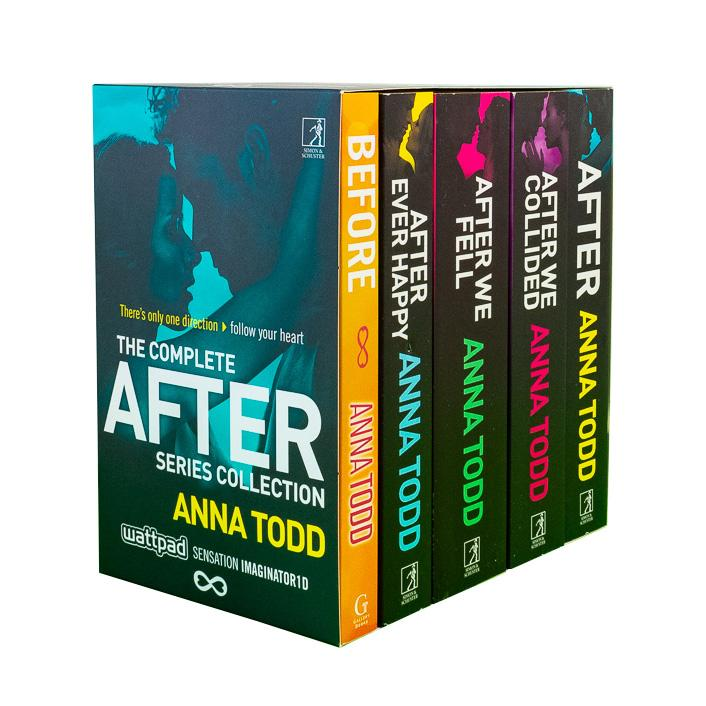

```{r setup, include=FALSE}
knitr::opts_chunk$set(echo = FALSE)
```



Certains auteurs dépassant les millions de lectures sur Wattpad peuvent espérer un jour être publier. Ça a été le cas pour Anna Todd, l’auteure de la saga à succès *After*.
D’après elle, une bonne histoire doit avoir une écriture simple, directe et feuilletonesque. Ce qui permettrait à ses lecteurs de passer le temps lors dans les transports en communs.  Les lectures qu’offrent Wattpad permettent de passer le temps à n’importe quel endroit, et d’interagir par la suite avec l’auteur. Leur succès vite du fait que l’écriture et la lecture peut se faire sur les téléphones. Ce qui a permis de constater que plus de personne, que l’on imaginait, aimait lire.
La plateforme a fait le choix d’imposer un format de feuilleton qui est une vieille méthode littéraire.
Certains auteurs connus ont dû utiliser cette même méthode pour survivre, on peut citer :

* Charles Dickens

* Sir Arthur Conan Doyle

* Alexandre Dumas

* Honoré de Balzac

* Stephen King

Les nouveaux auteurs n’hésitent d’ailleurs spas à se comparer à eux. 
Pour les fans, le succès vient du **lien de proximité qui s’instaure entre les lecteurs et les auteurs**, plutôt que du genre à la mode. Les échanges entre auteurs et lecteurs sont importants pour ces communautés qui n’hésitent pas à défendre leur coup de cœur. Pour Anna Todd, les avis apportés par les fans ont été très important pour l’élaboration de sa saga. Par contre d’autres auteurs ne trouvent pas ces échanges aussi encourageants qu’elle.
Il n’y a pas qu’en Amérique que les auteurs de Wattpad connaissent un franc succès. Mais la France aussi à son palmarès d’auteurs à succès.

Source : <https://www.hachette.fr/actualites/wattpad-les-auteurs-de-la-plate-forme-numerique-lassaut-du-livre-papier>

