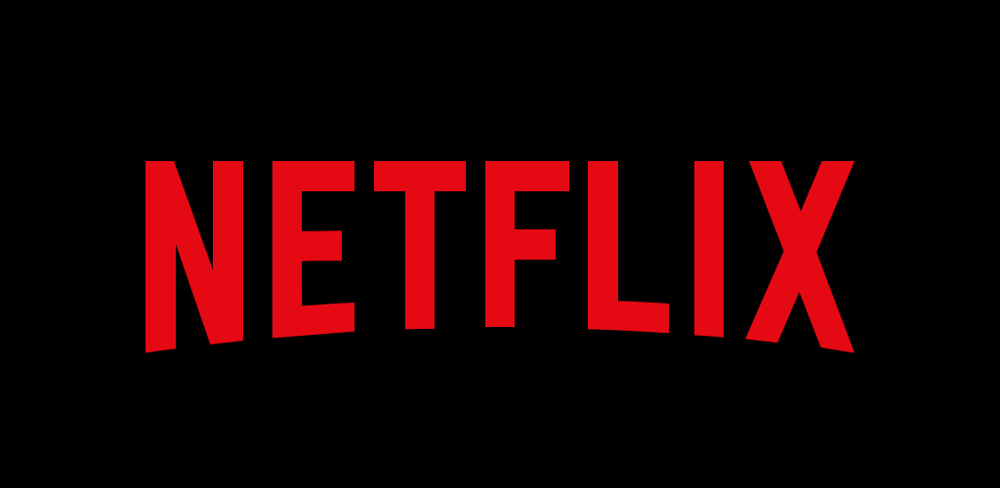

```{r setup, include=FALSE}
knitr::opts_chunk$set(echo = FALSE)
```

# Netflix
Certains des films romantiques les plus connus nous viennent tout droit de Wattpad, on peut citer *Cinquante nuances de Grey*, *After* et *The Kissing Booth*. Ce dernier avait eu des millions de lectures sur la plateforme avant d’être publié et il est devenu par la suite **le film le plus vu sur Netflix**. Wattpad avait participé à la promotion du film, mais il n’a pas cherché à s’imposer dans la production du film. Il voulait juste que les lecteurs soient au courant de cette sortie.
Le partenariat entre Wattpad et Netflix a permis aux 2 de faire des profits. Wattpad a pu augmenter sa quantité de lecteur et Netflix le nombre de ses abonnés. La plateforme a aussi de nombreux autres partenaires dans le domaine visuel.



# *Machine learning*
Le repérage des prochains succès se fait grâce à une intelligence artificielle : **Machine learnig**. Elle est capable de repérer les meilleures histoires, qui sont par la suite analysée. Cette technique a permis de dénicher quelques perles rares comme la trilogie * White Stag* dont Wattpad a pu remarquer que ses lecteurs passaient beaucoup plus de temps à la lire que les autres histoires. Une autre mode qui est utilisé, c’est les tags utilisés par les lecteurs. La plateforme va les analyser les tags les plus utilisés et recherchés pour ensuite affiner les résultats concernant les histoires les plus lues.

Source : <https://www.letemps.ch/culture/plateforme-wattpad-denicheuse-talents-netflix>
